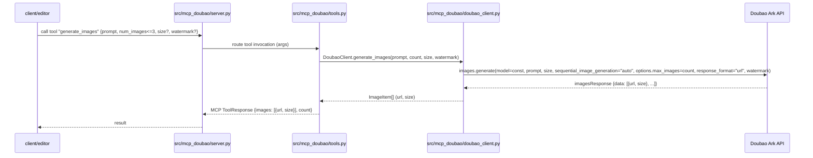
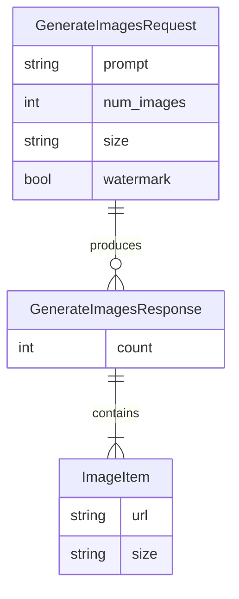
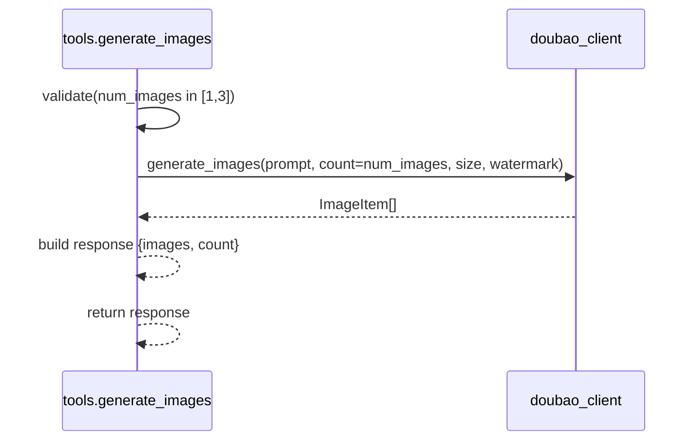

# Doubao MCP 文生图 详细设计（LLD）

本设计文档遵循 `rules/LLDesign.md` 要求，面向当前迭代（仅文生图，MCP stdio，固定模型与端点，无外部配置），并包含项目初始化方案（uv）。

## 项目结构与总体设计
- 目标：构建一个 Python MCP Server，通过 stdio 暴露单一工具 `generate_images`，调用 Doubao Ark 的 `images.generate` 实现“文生图（text-to-image）”。
- 约束与确认：
  - 仅文生图；不实现图生文或图生图（参考图）。
  - 模型与端点固定为示例常量；鉴权与配置不暴露为环境变量（API Key 写为代码常量，开发演示用）。
  - 不实现专门的超时、重试、并发控制。
  - 依赖与打包使用 `uv + pyproject.toml`。
- 交互：客户端调用 MCP 工具 `generate_images(prompt, num_images<=3, size?, watermark?)`，MCP 转 Doubao Ark SDK 请求，返回图片 URL 与 size 列表。

## 目录结构
seedream_mcp/                   # 当前项目根目录
  pyproject.toml                # ✅ 已存在，需添加 volcengine 依赖
  README.md                     # ✅ 已存在
  main.py                       # ✅ 已存在
  uv.lock                       # ✅ uv 依赖锁定文件
  .venv/                        # ✅ 虚拟环境目录
  .python-version               # ✅ Python 版本文件
  .gitignore                    # ✅ Git 忽略文件
  docs/
    mcp_doubao_lld.md          # ✅ 当前设计文档
  rules/                        # ✅ 项目规则文档
    LLDesign.md
    app.md
    coding.md
    codingplan.md
    pages.md
  src/mcp_doubao/              # ✅ 已创建的主要代码目录
    __init__.py                 # ✅ 已创建
    server.py                   # ✅ 已创建
    tools.py                    # ✅ 已创建
    doubao_client.py            # ✅ 已创建
    config.py                   # ✅ 已创建
    types.py                    # ✅ 已创建
  scripts/                      # ✅ 已创建目录
    run_stdio.sh                # ✅ 占位文件已创建
  examples/                     # ✅ 已创建目录
    prompts.txt                 # ✅ 占位文件已创建
  tests/                        # ✅ 已创建目录
    test_generate_images.py     # ✅ 占位文件已创建

说明：
- `server.py`：MCP 服务器入口（stdio），注册工具。
- `tools.py`：定义 `generate_images` 工具参数校验与输出封装。
- `doubao_client.py`：封装 Doubao Ark SDK 调用。
- `config.py`：按本迭代要求仅内置常量（API Key 等）。
- `types.py`：请求/响应数据结构（TypedDict 或 dataclass）。
- `examples/`、`tests/`、`scripts/`：为后续迭代保留；当前占位。

## 整体逻辑和交互时序图
- 核心流程：Client 发起 MCP 工具调用 → `server` 路由到 `tools.generate_images` → `doubao_client` 调用 Ark SDK `images.generate` → 返回 URL 列表。

## API 接口定义（MCP 工具）
- 工具名：`generate_images`
- 方式：MCP tool over stdio（JSON-RPC 样式调用，由 MCP 框架处理）
- 入参：
  - `prompt`: string，必填。生成图像的文本描述。
  - `num_images`: integer，选填，默认 1，范围 [1, 3]。
  - `size`: string，选填，默认 "2K"。
  - `watermark`: boolean，选填，默认 true。
- 出参：
  - `images`: Array<{ `url`: string, `size`: string }>
  - `count`: number
- 错误：
  - 参数错误（`ValueError`）
  - 提供方调用错误（`ProviderError`）：Doubao Ark 返回错误码或 SDK 异常
- 说明：
  - 不支持传入参考图或本地图片；仅文生图。
  - 批量通过 `num_images` 控制，最大 3，对应 Ark 的 `SequentialImageGenerationOptions(max_images=n)`。

## 数据库表设计
- 本迭代：不涉及数据库与持久化。
- 预留（迭代n再实现，用固定返回值占位）：
  - `mcp_invocations`：记录调用日志、prompt、返回数量、时间、耗时、错误码。
  - `generated_images`：记录 url、size、关联调用 id。

## 数据实体结构深化
- 实体：
  - `GenerateImagesRequest`
    - `prompt`: string
    - `num_images`: int (1-3)
    - `size`: string (default "2K")
    - `watermark`: bool (default true)
  - `ImageItem`
    - `url`: string
    - `size`: string
  - `GenerateImagesResponse`
    - `images`: `ImageItem[]`
    - `count`: int

## 配置项
- 本迭代不引入外部可变配置；常量硬编码于 `src/mcp_doubao/config.py`：
  - `BASE_URL = "https://ark.cn-beijing.volces.com/api/v3"`
  - `MODEL_ID = "doubao-seedream-4-0-250828"`
  - `ARK_API_KEY = "REPLACE_WITH_YOUR_KEY"`  // 开发演示用，占位待手动替换
  - `DEFAULT_SIZE = "2K"`
  - `MAX_IMAGES = 3`
- 提示：按你的要求本迭代不做外部配置，API Key 将以内联常量形式存在（仅用于演示/开发）。

## 模块化文件详解（File-by-File Breakdown）

### `src/mcp_doubao/server.py`
- 用途：MCP 服务器入口；创建 MCP 应用、注册工具、启动 stdio。
- 函数/方法详解：
  - `run_stdio()`
    - 用途：启动 MCP stdio 服务。
    - 输入：无。
    - 输出：无（进程常驻）。
    - 实现流程：
      1. 初始化 MCP 应用。
      2. 注册 `tools.generate_images`。
      3. 监听 stdin/stdout（stdio transport）。
      4. 路由请求，返回工具执行结果。

### `src/mcp_doubao/tools.py`
- 用途：声明 MCP 工具 `generate_images` 的参数校验与适配；调用 Doubao 客户端。
- 函数/方法详解：
  - `generate_images(prompt: str, num_images: int = 1, size: str = "2K", watermark: bool = True) -> dict`
    - 用途：将 MCP 请求转换为 Doubao Ark SDK 调用，并将响应规范化为 MCP 返回结构。
    - 输入：见签名。
    - 输出：`{"images": [{"url": str, "size": str}], "count": int}`。
    - 时序：

### `src/mcp_doubao/doubao_client.py`
- 用途：封装豆包 Ark SDK 调用细节。
- 函数/方法详解：
  - `generate_images(prompt: str, count: int, size: str, watermark: bool) -> List[ImageItem]`
    - 输入：prompt、count、size、watermark。
    - 输出：`ImageItem[]`（url、size）。
    - 实现要点：
      - 初始化 Ark 客户端 `Ark(base_url=BASE_URL, api_key=ARK_API_KEY)`。
      - 调用：
        - `client.images.generate(model=MODEL_ID, prompt=prompt, size=size, sequential_image_generation="auto", sequential_image_generation_options=SequentialImageGenerationOptions(max_images=count), response_format="url", watermark=watermark)`。
      - 解析 `imagesResponse.data` → `ImageItem[]`。

### `src/mcp_doubao/config.py`
- 用途：集中放置常量（本迭代内嵌）。
- 常量：`BASE_URL`、`MODEL_ID`、`ARK_API_KEY`、`DEFAULT_SIZE`、`MAX_IMAGES`。
- 未来演进：可迁移为环境变量或 .env 管理。

### `src/mcp_doubao/types.py`
- 用途：请求/响应与内部模型定义（`TypedDict` 或 `dataclass`）。
- 类型：`GenerateImagesRequest`、`ImageItem`、`GenerateImagesResponse`。

### `README.md`
- 用途：说明安装、运行、客户端集成与工具示例。
- 关键内容：
  - 安装与运行（uv）。
  - MCP 客户端如何注册（stdio）。
  - 调用示例（使用 `prompt` 生成 1-3 张图片）。
  - 注意事项（API Key 常量需手动替换）。

## 项目初始化（使用 uv）
- 目标：生成可用的 Python 包工程（src 布局），安装 MCP 与 Doubao Ark 依赖。
- 建议步骤（在项目根目录 `seedream_mcp/` 执行）：
  1. ✅ 已完成：项目目录已存在，`pyproject.toml` 已初始化。
  2. ✅ 已完成：`uv add mcp` 已执行。
  3. ✅ 已完成：`uv add "volcengine-python-sdk[ark]"` 已执行。
  4. ✅ 已完成：`src/mcp_doubao/` 目录及相关 Python 模块已创建。
  5. 待实现：编写各模块代码内容。
  6. 运行服务器（开发）：`uv run python -m mcp_doubao.server`。
- 说明：
  - `uv` 会生成 `uv.lock` 进行锁定；不需要手动编辑。

## 最小可用测试方案
- 启动：`uv run python -m mcp_doubao.server`。
- 在 MCP 客户端注册 stdio 服务器。
- 调用工具：
  - `prompt`: "生成3张女孩和奶牛玩偶在游乐园开心地坐过山车的图片，涵盖早晨、中午、晚上"
  - `num_images`: 3
  - `size`: "2K"
- 预期：返回 3 个 `{url, size}`。
- 稳定性：本迭代无重试/超时；SDK 或服务异常将直接抛出提供方错误。

## 迭代演进依据
- 配置外化：将常量（BASE_URL、MODEL_ID、API Key）迁移到环境变量与 `.env`，提供安全指引。
- 可靠性增强：超时、重试、限流与错误分类；并发控制。
- 观测性：结构化日志与调用统计；必要时持久化（数据库 schema 已预留）。
- 工具扩展：`get_models`、`get_quota`、`describe_image` 等；或支持流式、细化尺寸枚举。
- 能力扩展：`image-to-image` 与参考图；如需本地路径，需支持上传或本地→可访问 URL 的桥接模块。

